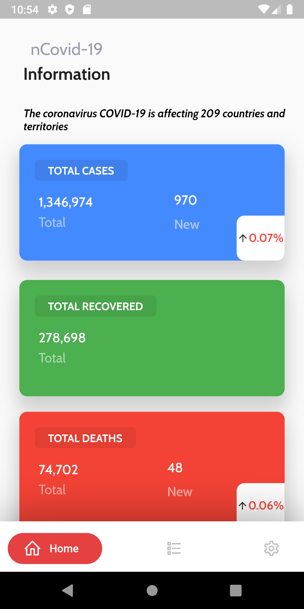
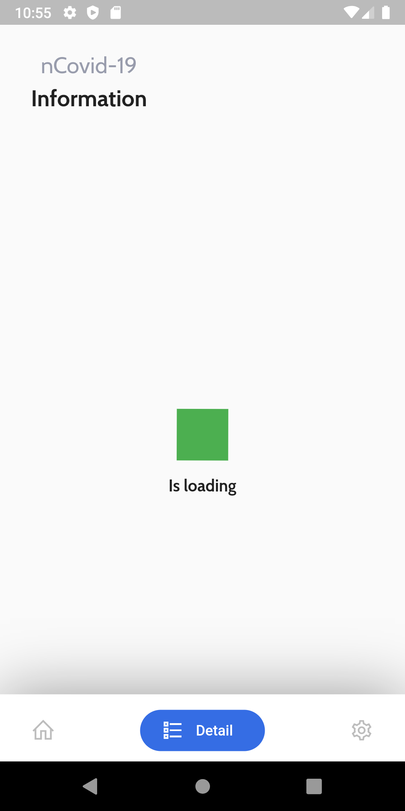
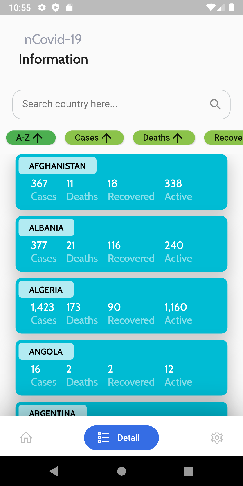
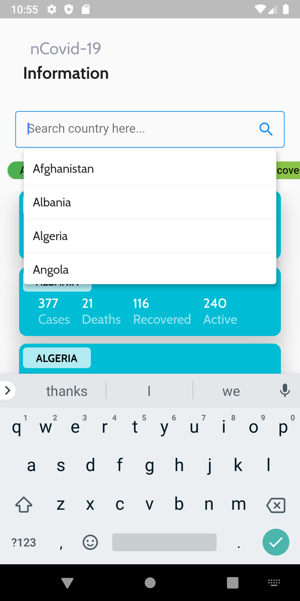
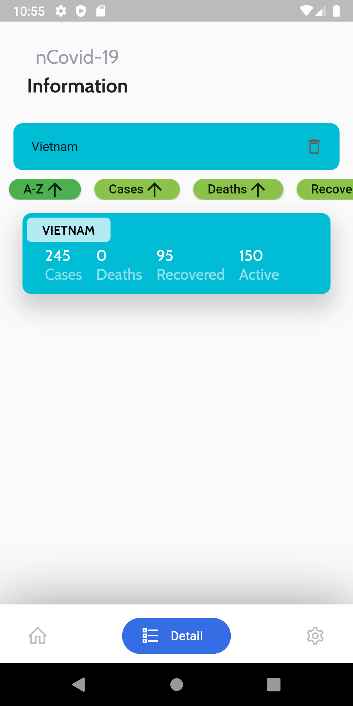
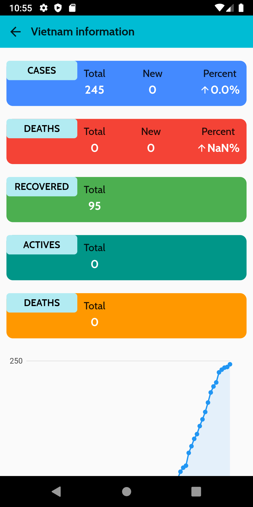
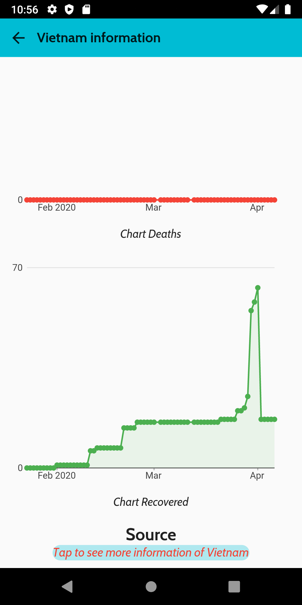
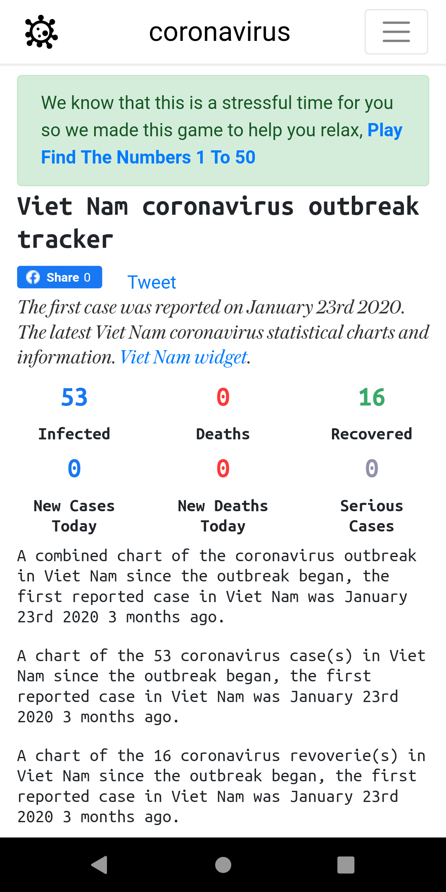

# ncov19infor

A  application about ncovid-19.
The [The Virus Tracker API](https://thevirustracker.com/api) was used to provide the data.

## ✨ Features
- [x] See all cases statistics.
- [x] List all of country.
- [x] Search country.
- [x] Watch detail of each country ( cases, deaths, recovered, chart, source,....)

## 📸 Screenshots

&nbsp;

&nbsp;

&nbsp;

&nbsp;

## 🤓 Author(s)
**Nguyen Duc Trung**